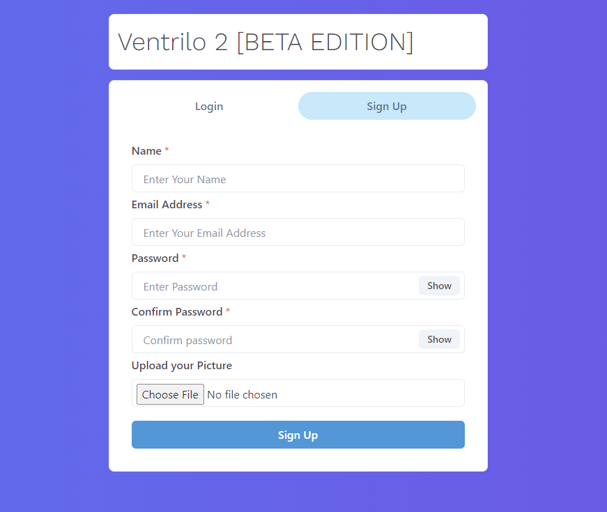
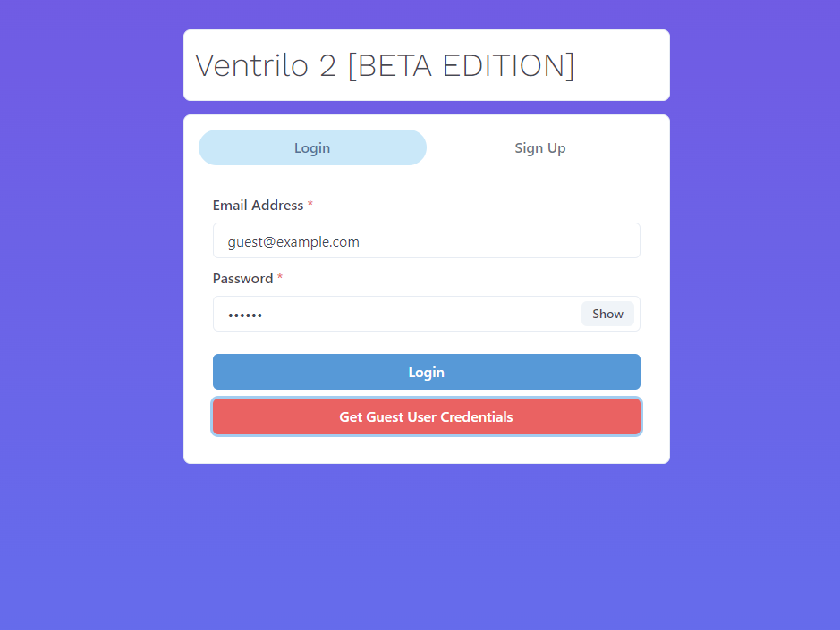
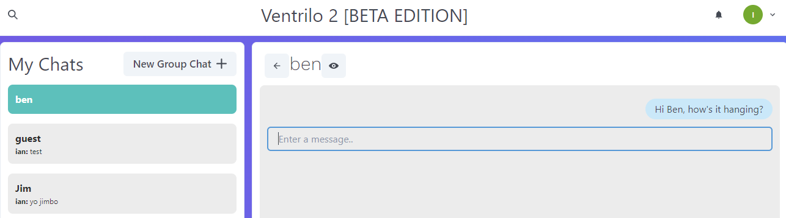

# p3-mern-chat

## Description
  
The goal of this application was to utilize all the skills and knowledge we had accumulated up until this point to 
re-create something that the three of us use on an daily basis, this being a messaging application.

Inspired by applications like Discord, Ventrilo, TeamSpeak, and Mumble. This application allows users to text chat with as little as one other user, or as many as your heart desires.
  
## Table of Contents (Optional)
  
 - [Installation](#installation)
 - [Usage](#usage)
 - [Credits](#credits)
 - [Features](#features)
 - [Questions](#questions)
  
## Installation
  
No installation needed, but if you'd like to run the application locally or make your own changes, just clone the
repo to your local machine, run "npm install", then "npm run build" to get everything needed installed and complied.

From here just run "npm start".

Please note that if you go this route you will need to have a .env file locally that has the following values:
 - PORT
 - MONGO_URI
 - JWT_SECRET
  
## Usage

To try the app out for yourself, just follow the link below and navigate to "Sign Up" to create a user.

Once you've created a user you'll be able to login

Upon login you'll be able search for users to chat with, create group chats, and create a profile for yourself.

  
To try it out for yourself, click [here](https://p3-mern-chat.onrender.com).
  
## Credits
  
Ben Mallar, Bryan Lebeuf, and Ian Wolfe.
  
## Features
  
This project features Apollo, bcrypt, dotenv, express, graphql, jsonwebtoken, mongoose, socket.io, chakra, axios, react, and probably more.

## Questions

For any questions about this project, please visit Ian's [GitHub](https://github.com/enkw).
